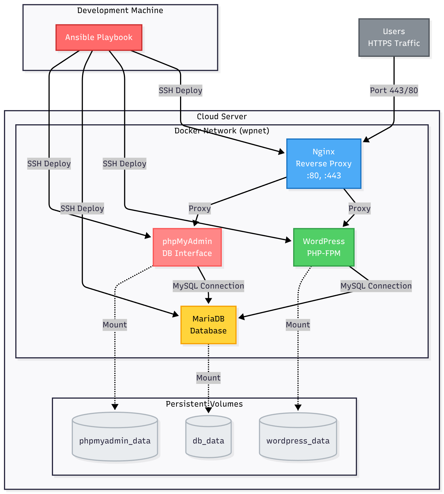

# 🚀 Cloud-1: Automated WordPress Infrastructure


Enterprise-grade infrastructure automation that deploys a complete, production-ready WordPress stack on cloud servers using **Ansible** orchestration and **Docker** containerization. This project demonstrates DevOps best practices, infrastructure-as-code principles, and secure multi-service deployment.

[](https://www.ansible.com/)
[](https://www.docker.com/)
[](https://wordpress.org/)
[](https://nginx.org/)
[](https://mariadb.org/)

---

## 📋 Table of Contents

- [Overview](#-overview)
- [Architecture](#-architecture)
- [Features](#-features)
- [Technology Stack](#-technology-stack)
- [Prerequisites](#-prerequisites)
- [Quick Start](#-quick-start)
- [Configuration](#-configuration)
- [Security](#-security)
- [Project Structure](#-project-structure)
- [Contributing](#-contributing)

---

## 🎯 Overview

This project automates the entire deployment lifecycle of a WordPress infrastructure, from server provisioning to application deployment. It uses Ansible's declarative approach to ensure idempotent, repeatable deployments across multiple environments.

### Key Highlights

✅ **One-Command Deployment** - Deploy complete stack with a single command  
✅ **Infrastructure as Code** - Version-controlled, repeatable infrastructure  
✅ **Security First** - SSL/TLS encryption, network isolation, secrets management  
✅ **Production Ready** - Persistent storage, automatic restarts, optimized configuration  
✅ **Multi-Environment** - Support for dev, staging, and production deployments  

---

## 🏗️ Architecture



The infrastructure consists of four containerized services orchestrated by Docker Compose and deployed via Ansible:

- **Nginx**: TLS-terminating reverse proxy handling all external traffic on ports 80/443
- **WordPress**: Custom-built container with PHP-FPM optimization
- **MariaDB**: Isolated database server with persistent storage
- **phpMyAdmin**: Web-based database management interface

All services communicate over an isolated Docker network (`wpnet`), with only Nginx exposed to the internet. Data persistence is achieved through bind-mounted volumes on the host system.

---

## ✨ Features

### Infrastructure Automation
- 🤖 **Idempotent Ansible playbooks** for reliable re-deployment
- 📦 **Modular role-based architecture** for reusability
- 🔄 **Jinja2 templating** for dynamic configuration generation
- 🎯 **Multi-server deployment** from single inventory

### Security
- 🔒 **SSL/TLS encryption** with self-signed or custom certificates
- 🛡️ **Network isolation** - Database not accessible externally
- 🔐 **Ansible Vault** for encrypted secrets management
- 🚪 **Minimal attack surface** - Only ports 80/443 exposed

### Application Features
- 🌐 **Automatic WordPress installation** with pre-configured users
- 💾 **Persistent data storage** with bind mounts
- 📊 **phpMyAdmin interface** for database management
- ⚡ **PHP-FPM optimization** for better performance
- 🔄 **Automatic container restarts** on failure

---

## 🛠️ Technology Stack

| Component | Technology | Purpose |
|-----------|-----------|---------|
| **Orchestration** | Ansible | Infrastructure automation and configuration management |
| **Containerization** | Docker, Docker Compose | Service isolation and orchestration |
| **Web Server** | Nginx | Reverse proxy and SSL/TLS termination |
| **Application** | WordPress, PHP-FPM | Content management system |
| **Database** | MariaDB | Relational database |
| **DB Management** | phpMyAdmin | Database administration interface |
| **Secrets** | Ansible Vault | Encrypted credential storage |

---

## 📋 Prerequisites

- **Control Machine** (where you run Ansible):
  - Ansible 2.9+
  - Python 3.6+
  - SSH access to target servers

- **Target Server(s)**:
  - Ubuntu 20.04+ or Debian 10+ (recommended)
  - Root or sudo access
  - Minimum 2GB RAM, 2 CPU cores
  - 20GB free disk space

---

## 🚀 Quick Start

### 1. Clone the Repository

```bash
git clone https://github.com/momeaizi/cloud-1.git
cd cloud-1
````

---

## 🚀 Usage

### 1. Configure your secrets and environment

Create and edit the file `group_vars/all.yml` with your desired credentials:

```yaml
MYSQL_USER: myuser
MYSQL_PASSWORD: mypassword
MYSQL_DATABASE: wordpress_db
DB_HOST: mariadb


WP_ADMIN_LOGIN: admin
WP_ADMIN_EMAIL: admin@example.com
WP_ADMIN_PASSWORD: adminpass

WP_AUTHOR_LOGIN: author
WP_AUTHOR_EMAIL: author@example.com
WP_AUTHOR_PASSWORD: authorpass
````

### 2. Configure Secrets

Edit the encrypted variables file (or create a new one):

```bash
ansible-vault edit group_vars/all.yml
```

Set your credentials:

```yaml
# Database Configuration
MYSQL_USER: wordpress_user
MYSQL_PASSWORD: secure_db_password
MYSQL_DATABASE: wordpress_db
DB_HOST: mariadb

# WordPress Admin User
WP_ADMIN_LOGIN: admin
WP_ADMIN_EMAIL: admin@example.com
WP_ADMIN_PASSWORD: secure_admin_password

# WordPress Author User
WP_AUTHOR_LOGIN: author
WP_AUTHOR_EMAIL: author@example.com
WP_AUTHOR_PASSWORD: secure_author_password
```

**Note:** Update `vault-pass.txt` with your vault password, or remove it and use `--ask-vault-pass` flag.

### 3. Generate SSL Certificates

Create self-signed certificates for HTTPS:

```bash
mkdir -p roles/nginx/files/certs
cd roles/nginx/files/certs

openssl req -x509 -nodes -days 365 \
  -newkey rsa:2048 \
  -keyout selfsigned.key \
  -out selfsigned.crt \
  -subj "/C=US/ST=State/L=City/O=Organization/CN=yourdomain.com"
```

For production, replace with certificates from Let's Encrypt or your certificate authority.

### 4. Configure Target Servers

Edit `inventory.yaml` with your server details:

```yaml
all:
  hosts:
    production:
      ansible_host: YOUR.SERVER.IP
      ansible_user: root
```

For multiple environments:

```yaml
all:
  hosts:
    staging:
      ansible_host: 192.168.1.10
      ansible_user: root
    production:
      ansible_host: 203.0.113.50
      ansible_user: root
```

### 5. Deploy

Deploy the complete stack:

```bash
make deploy
```

Or manually:

```bash
ansible-playbook -i inventory.yaml site.yaml
```

### 6. Access Your Services

After successful deployment:

- **WordPress**: `https://YOUR.SERVER.IP`
- **phpMyAdmin**: `https://YOUR.SERVER.IP/phpmyadmin`

---

## ⚙️ Configuration

### Customizing WordPress

Edit `group_vars/all.yml` to modify WordPress settings, database configuration, or user credentials.

### Nginx Configuration

Modify `roles/nginx/files/conf.d/default.conf` to customize:
- Server names
- SSL/TLS settings
- Proxy configurations
- Security headers

### Docker Compose Template

The `roles/stack/templates/docker-compose.yml.j2` file defines the container orchestration. Modify it to:
- Add new services
- Change resource limits
- Adjust network configuration
- Configure health checks

---

## 🔐 Security

This project implements multiple security layers:

### Network Security
- ✅ Only ports 80 and 443 exposed to the internet
- ✅ Database isolated on internal Docker network
- ✅ No direct database access from outside
- ✅ Services communicate only through defined networks

### Data Security
- ✅ Ansible Vault encryption for sensitive credentials
- ✅ SSL/TLS encryption for all web traffic
- ✅ Secure environment variable injection
- ✅ No hardcoded secrets in codebase

### Best Practices
- ✅ Principle of least privilege
- ✅ Regular security updates via base images
- ✅ Container isolation (one process per container)
- ✅ Persistent storage outside containers

### Security Recommendations

1. **Change default passwords** in `group_vars/all.yml`
2. **Use strong vault password** in `vault-pass.txt`
3. **Never commit** `vault-pass.txt` to version control
4. **Use production SSL certificates** (Let's Encrypt)
5. **Regularly update** Docker base images
6. **Enable firewall** on target servers (UFW/iptables)
7. **Implement SSH key authentication** and disable password auth
8. **Regular backups** of persistent volumes

---

## 📁 Project Structure

```
.
├── ansible.cfg                    # Ansible configuration
├── inventory.yaml                 # Target server inventory
├── site.yaml                      # Main playbook
├── vault-pass.txt                 # Vault password (gitignored)
├── Makefile                       # Deployment shortcuts
├── group_vars/
│   └── all.yml                    # Encrypted variables (vault)
└── roles/
    ├── common/                    # Docker installation
    │   └── tasks/
    │       └── main.yml
    ├── mariadb/                   # Database setup
    │   └── tasks/
    │       └── main.yml
    ├── wordpress/                 # WordPress container
    │   ├── files/
    │   │   ├── Dockerfile         # Custom WordPress image
    │   │   ├── conf/
    │   │   │   └── php-fpm.conf   # PHP-FPM configuration
    │   │   └── tools/
    │   │       └── wp_install.sh  # WordPress setup script
    │   └── tasks/
    │       └── main.yml
    ├── phpmyadmin/                # Database UI
    │   └── tasks/
    │       └── main.yml
    ├── nginx/                     # Reverse proxy
    │   ├── files/
    │   │   ├── certs/             # SSL certificates
    │   │   └── conf.d/
    │   │       └── default.conf   # Nginx configuration
    │   └── tasks/
    │       └── main.yml
    └── stack/                     # Docker Compose orchestration
        ├── templates/
        │   └── docker-compose.yml.j2  # Compose template
        └── tasks/
            └── main.yml
```

---

## 🎯 Use Cases

- **Development Environment**: Quick WordPress setup for development
- **Staging Server**: Test deployments before production
- **Production Hosting**: Secure, automated WordPress hosting
- **Learning DevOps**: Hands-on with Ansible, Docker, and infrastructure automation
- **Portfolio Project**: Demonstrate infrastructure automation skills

---

## 🤝 Contributing

Contributions are welcome! Please feel free to submit a Pull Request.

1. Fork the repository
2. Create your feature branch (`git checkout -b feature/amazing-feature`)
3. Commit your changes (`git commit -m 'Add some amazing feature'`)
4. Push to the branch (`git push origin feature/amazing-feature`)
5. Open a Pull Request

---

## 📝 License

This project is part of the 42 School curriculum.

---

## 🙏 Acknowledgments

- 42 Network for the project requirements
- Ansible and Docker communities for excellent documentation
- WordPress and MariaDB teams for robust open-source software

---

## 📧 Contact

**Mohamed Ait Maazi**  
GitHub: [@momeaizi](https://github.com/momeaizi)

---

<div align="center">
  <p>⭐ Star this repository if you found it helpful!</p>
  <p>Made with ❤️ for learning and sharing DevOps knowledge</p>
</div>
